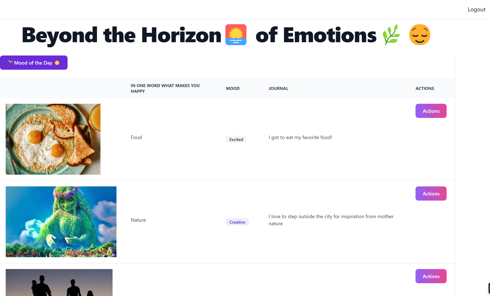

# WELCOME TO "BEYOND THE HORIZON OF EMOTIONS

This is a mood board where people can post about how they feel.


## Tech Stack

**Client:** EJS, Javascript, Flowbite, TailwindCSS, FontAwesome, HTML/CSS

**Server:** Node, Express, Passport, Mongoose, MongoDB


## Features

- User login and authentication
- Contribute Community Page with how you feel and what inspired those feelings
- Add a new mood to your mood board by selecting "Mood of the Day"
- Click "Actions" to edit or delete an existing mood from your mood board

## How To

1. Create Sign up
2. Login In
3. Contribute to Community Page
4. Enter one thing that makes you happy
5. Update your Mood
6. Write a sentence on how you feel
7. Enjoy !


## Screenshots




## Run Locally

Clone the project

```bash
  git clone https://github.com/socratic617/fullstackApp-user-login-in.git
```

Go to the project directory

```bash
  cd fullstackApp-two-user-login-in
```

Install dependencies

```bash
  npm install
```

Start the server

```bash
  npm start
```


## Lessons Learned

How to use an actions drop down menu and pass the mood id so i can edit/delete it.
How to use a table and how to dynamically add rows.

